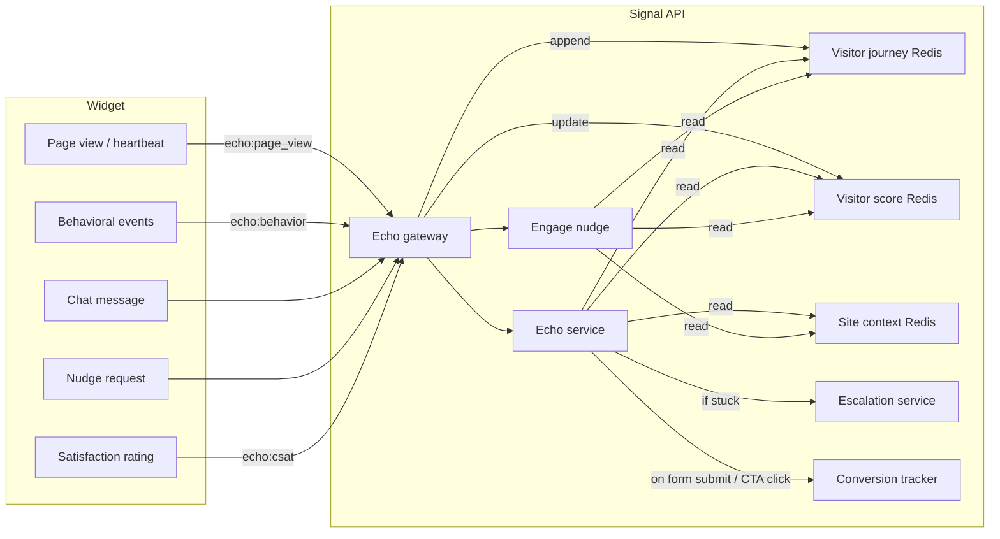

# Echo: Intelligent Context, Marketing & Customer Service via Redis

## Goal

- Echo **passively sees** analytics: store the visitor's journey (pages + time + interactions) in Redis so nudge and chat can read it without the widget having to send it on every request.
- Echo **knows the site**: have a canonical set of fields per project in Signal (forms, services, key pages, CTAs, business hours, FAQs) so conversations and nudges are dynamic and contextual.
- Echo **scores intent**: classify where a visitor is in the buying funnel (browsing → interested → evaluating → ready-to-buy) so responses, nudges, and tools adapt automatically.
- Echo **acts as a marketing agent**: proactively engage visitors with the right message at the right time — exit-intent offers, returning visitor recognition, service recommendations, social proof.
- Echo **acts as a customer service agent**: resolve common questions instantly, escalate gracefully to humans when needed, track satisfaction, and follow up.
- Keep it **fast**: Redis already exists in Signal; add a small set of keys and one optional cache layer for project site context.

---

## Current state

- **Redis**: Signal already uses [RedisService](signal-api-nestjs/src/shared/redis/redis.service.ts) and [ConversationSessionService](signal-api-nestjs/src/shared/redis/conversation-session.service.ts) (keys `session:{conversationId}:`*). [ProjectStateManager](signal-api-nestjs/src/shared/redis/project-state.manager.ts) caches project-level state (`project:{projectId}:state`, etc.) for SEO/CRM/analytics.
- **Echo**: [streamExternal](signal-api-nestjs/src/modules/echo/echo.service.ts) builds `visitorContext` from params (pageUrl, visitorName, etc.) and visitor memory (DB). Nudge receives pageUrl, timeOnPage, browsingHistory, visitorMemory in the request only.
- **Site data**: [engage-design getPageContext](signal-api-nestjs/src/modules/skills/engage/services/engage-design.service.ts) loads from `signal_knowledge` + `seo_pages`. [echo-public.gateway](signal-api-nestjs/src/modules/echo/echo-public.gateway.ts) loads forms from `managed_forms` (Supabase) on demand for `echo:form:get`.
- **Tools available to external Echo LLM today**: `update_memory`, `show_form`, `suggest_action` — that's it.
- **Intents today**: `echo-external`, `echo-external-lead-capture`, `echo-external-scheduling`, `echo-external-faq` — all gated to `knowledge` context only.

### What's missing for marketing & customer service


| Gap                                | Impact                                                                                        |
| ---------------------------------- | --------------------------------------------------------------------------------------------- |
| No funnel/intent scoring           | Echo treats every visitor the same — can't differentiate a tire-kicker from a ready buyer     |
| No proactive engagement triggers   | Nudges only fire on timer, not on behavioral signals (exit intent, scroll depth, rage clicks) |
| No returning visitor recognition   | 24h TTL means repeat visitors next week are strangers again                                   |
| No traffic source awareness        | Can't tailor messaging for Google Ads vs organic vs referral                                  |
| No human escalation path           | Frustrated visitors hit a dead end — no handoff to live agent                                 |
| No satisfaction tracking           | No way to measure if Echo is helping or hurting                                               |
| No business hours context          | Echo can't set expectations for response times                                                |
| No rich media tools                | Can't share links, images, videos, or comparison tables                                       |
| No product/service recommendations | Can't cross-sell or upsell based on what visitor is looking at                                |
| No conversion tracking             | Can't attribute form fills, calls, or purchases back to Echo interactions                     |
| No email follow-up                 | Conversation dies when visitor leaves the site                                                |
| No FAQ auto-detection              | Every FAQ question burns a full LLM call instead of instant lookup                            |


---

## Schema alignment: use existing analytics and data

Before adding new Redis keys or write paths, the plan should **prefer existing Supabase tables and API flows** so Signal reuses a single source of truth and avoids duplicating analytics.

### Existing schema that already supports journey and context


| Plan concept                          | Existing source                           | Notes                                                                                                                                                                                                                                                                                                                                                                                                                                                                              |
| ------------------------------------- | ----------------------------------------- | ---------------------------------------------------------------------------------------------------------------------------------------------------------------------------------------------------------------------------------------------------------------------------------------------------------------------------------------------------------------------------------------------------------------------------------------------------------------------------------- |
| **Visitor journey (path + time)**     | `analytics_sessions.journey_path` (jsonb) | Format: `[{"page": "/path", "timestamp": "ISO8601", "duration": seconds, "scrollDepth": optional}, ...]`. Updated when site-kit (or any client) calls **Portal** `POST api/public/analytics/session` with `journeyStep` and `previousPageDuration`. See [SessionsRepository.appendJourneyStep](portal-api-nestjs/src/modules/analytics/repositories/sessions.repository.ts) and [IngestService.handleSession](portal-api-nestjs/src/modules/analytics/services/ingest.service.ts). |
| **Page views (fallback for journey)** | `analytics_page_views`                    | One row per view: `project_id`, `session_id`, `visitor_id`, `path`, `created_at`. If `journey_path` is empty, Signal can derive recent journey by querying last N rows per `visitor_id` and computing time-on-page from consecutive `created_at`.                                                                                                                                                                                                                                  |
| **Forms list (site context)**         | `managed_forms`                           | Columns: `project_id`, `slug`, `name`, `description`. Signal already queries this in [echo-public.gateway](signal-api-nestjs/src/modules/echo/echo-public.gateway.ts) for `echo:form:get`. Use as source for `project:{projectId}:site_context` → `forms`.                                                                                                                                                                                                                         |
| **Key pages / services**              | `seo_pages`                               | Columns: `project_id`, `path`, `url`, `title`, `page_type`, etc. Signal already uses in [engage-design getPageContext](signal-api-nestjs/src/modules/skills/engage/services/engage-design.service.ts) and [seo-data.service](signal-api-nestjs/src/modules/skills/seo/services/seo-data.service.ts). Use for `keyPages` / `services` in site context.                                                                                                                              |
| **Identified / returning visitor**    | `known_visitors`                          | `visitor_id`, `project_id`, `contact_id`, `email`, `identified_at`. Optional: use to detect returning or identified users for personalization.                                                                                                                                                                                                                                                                                                                                     |
| **Session identity**                  | `analytics_sessions`                      | `session_id`, `visitor_id`, `project_id`, `first_page`, `last_page`, `page_count`, `duration_seconds`, `journey_path`. Lookup by `visitor_id` + `project_id` order by `updated_at` desc limit 1 to get “current” session and its journey.                                                                                                                                                                                                                                          |


### Data flow today

- **Page views**: Widget/site-kit sends `POST api/public/analytics/page-view` (Portal) → inserts `analytics_page_views`, upserts `analytics_sessions` (last_page, page_count, duration). **Important**: [PublicAnalyticsController](portal-api-nestjs/src/modules/public/public-analytics.controller.ts) page-view handler does **not** call `appendJourneyStep`; it only updates session metadata. So `journey_path` is **only** populated when the client also calls the **session** endpoint with `journeyStep` / `previousPageDuration` (e.g. site-kit with `trackJourneys`).
- **Journey steps**: Site-kit (when `trackJourneys` is on) sends `POST api/public/analytics/session` with `journeyStep` and `previousPageDuration` → IngestService → SessionsRepository.appendJourneyStep / updateLastJourneyStepDuration → `analytics_sessions.journey_path` updated.
- **Signal**: Already has Supabase and reads `analytics_page_views` and `analytics_sessions` in [web-analytics-data.service](signal-api-nestjs/src/modules/analytics/web-analytics-data.service.ts). So Signal **can** read journey and page-view data from the same DB.

### Recommended approach: Supabase-first, Redis as cache

1. **Visitor journey**
  - **Source of truth**: Supabase. In Signal, add a small **VisitorJourneyService** (or equivalent) that:
    - Takes `projectId` + `visitorId` (and optional `sessionId` if widget sends it).
    - Reads **latest session** for that visitor: `analytics_sessions` where `project_id = ?` and `visitor_id = ?` order by `updated_at` desc limit 1. Use that row’s `journey_path` if non-empty.
    - If `journey_path` is empty or missing, **fallback**: query `analytics_page_views` for `project_id` + `visitor_id` order by `created_at` desc limit 20; build a journey list and approximate time-on-page from `created_at` gaps.
  - **Redis**: Optional. Cache the resolved journey in `visitor:{projectId}:{visitorId}:journey` with short TTL (e.g. 3–5 min) so nudge/chat don’t hit Supabase on every request. Invalidate or overwrite when we receive new data (e.g. on `echo:message` or `echo:nudge` with current page + time). This way Redis is a **read-through cache** of Supabase, not the only store.
  - **Widget**: No change required for v1 if we key by `visitor_id`. Optionally have the widget send `session_id` (same as site-kit’s sessionId) so we can target the exact session when multiple tabs exist.
2. **Site context (forms, key pages, services)**
  - **Source of truth**: Supabase. Build `project:{projectId}:site_context` (or `echo_context`) from:
    - `managed_forms`: `slug`, `name`, (optional `description`) for the project.
    - `seo_pages`: filter by `project_id`, optionally `page_type` or path patterns, for `keyPages` / `services` (path, title).
  - **Redis**: Cache this object with TTL (e.g. 5–15 min). On cache miss, query Supabase and set key. No new tables; reuse [echo-public.gateway](signal-api-nestjs/src/modules/echo/echo-public.gateway.ts) / existing form and page loading patterns.
3. **Ensure journey_path is populated**
  - If the Echo host (e.g. Upforge) uses site-kit with `trackJourneys: true`, `journey_path` will already be filled via the session endpoint. If not, either:
    - **Option A**: Have the host enable `trackJourneys` and use the same API key so session + journey hit Portal and Signal can read from Supabase; or
    - **Option B**: In Portal’s **page-view** handler, when `sessionId` and `pagePath` (and optionally `previousPageDuration`) are present, also call `appendJourneyStep` / `updateLastJourneyStepDuration` so a single page-view request updates both `analytics_page_views` and `analytics_sessions.journey_path` without a separate session request.
4. **Behavioral signals / intent scoring**
  - Prefer deriving from existing data where possible: e.g. intent score from `journey_path` (pages + duration), UTM from `analytics_sessions` or `analytics_page_views`, scroll/engagement from `analytics_scroll_depth` if available. Optional Redis keys for real-time flags (e.g. `exitIntentFired`, `chatOpened`) can still be written by the widget and read by Signal, but the **canonical** history stays in Supabase.

### Summary of changes to the plan

- **Journey**: Read from `analytics_sessions.journey_path` (and fallback to `analytics_page_views`) in Signal; use Redis only as an optional read-through cache keyed by `visitor_id` (and optionally `session_id`).
- **Site context**: Build from `managed_forms` + `seo_pages`; cache in Redis with TTL; no new schema.
- **Portal**: Consider updating the page-view handler to write `journey_path` when sessionId + journey step data are present, so journey is populated even when the client only sends page-view (or add doc to require session endpoint for full journey).
- **Echo widget**: Continue sending `visitorId` (and optionally `sessionId`); no new events required for v1 if we resolve journey by `visitor_id` from Supabase.

---

## Architecture (expanded)




- **Per-visitor (Redis)**: journey + intent score + behavioral signals. Written passively by widget events and on each interaction. Read before every LLM call.
- **Per-project (Redis + DB)**: site context (forms, services, key pages, business hours, FAQ cache, tone/personality config). Cached with TTL, invalidated on project settings change.
- **Per-visitor long-term (DB)**: `signal_memory` already stores visitor preferences. Extend to store returning-visitor profile so recognition survives beyond Redis TTL.

---

## 1. Per-visitor journey in Redis (from original plan — kept + extended)

**Prefer existing schema**: See **Schema alignment** above. Journey should be read from Supabase (`analytics_sessions.journey_path`, fallback `analytics_page_views`) first; Redis is an optional read-through cache for speed.

**Key design**: `visitor:{projectId}:{visitorId}:journey`

- **Value**: JSON array of `{ path, timeSpentMs, timestamp, scrollDepth?, referrer? }`, last N entries (e.g. 30), newest last.
- **TTL**: 24 hours (session window).
- **Write**: On `echo:page_view` event (preferred — Option A from original plan) AND on each `echo:message` / `echo:nudge` as fallback.
- **Read**: In `streamExternal` and nudge path. Formatted for the prompt as: `"Visitor's journey: /services/web-design (2m12s, 85% scroll) → /portfolio (30s) → /contact (current, 45s)"`

**Change from original plan**: Promote Option A (`echo:page_view`) to **required for v1**, not optional. Without it, Echo is blind until the visitor sends a message — which kills the entire proactive marketing use case. The widget must emit page views on route change.

### New: Behavioral signals

**Key**: `visitor:{projectId}:{visitorId}:signals`

- **Value**: JSON object of behavioral flags, updated in real-time:

```json
  {
    "totalPageViews": 7,
    "totalTimeOnSiteMs": 185000,
    "pagesWithHighEngagement": ["/services/web-design", "/pricing"],
    "scrolledToBottom": ["/services/web-design"],
    "exitIntentFired": false,
    "returnVisit": false,
    "returnVisitCount": 0,
    "referrer": "google",
    "utmSource": "google_ads",
    "utmCampaign": "spring-promo",
    "device": "mobile",
    "chatOpened": false,
    "formsViewed": ["contact"],
    "formsStarted": [],
    "formsCompleted": [],
    "lastActivity": "2025-06-15T10:32:00Z"
  }
  

```

- **TTL**: 24 hours.
- **Write**: Widget emits `echo:behavior` with incremental updates (scroll depth, exit intent, form interactions). Gateway merges into Redis.
- **Read**: Alongside journey, before every LLM call and nudge decision.

---

## 2. Visitor intent scoring (NEW)

**Key**: `visitor:{projectId}:{visitorId}:score`

**Purpose**: Give Echo a real-time sense of where this visitor is in the buying funnel so it can adapt tone, urgency, and tools.

**Score model** (computed server-side in `VisitorJourneyService`):


| Signal                               | Points      |
| ------------------------------------ | ----------- |
| Visited pricing/packages page        | +15         |
| Visited contact/quote page           | +20         |
| Spent >2 min on a service page       | +10         |
| Scrolled >80% on a service page      | +5          |
| Viewed portfolio/case studies        | +8          |
| Opened chat widget                   | +10         |
| Sent a message                       | +15         |
| Asked about pricing/timeline/process | +20         |
| Started filling a form               | +15         |
| Return visit                         | +25         |
| From paid ad (UTM)                   | +10         |
| Multiple pages visited (>3)          | +5 per page |


**Funnel stages**:


| Score | Stage          | Echo behavior                                                                |
| ----- | -------------- | ---------------------------------------------------------------------------- |
| 0–20  | **Browsing**   | Soft nudges, educational tone, "Did you know we offer…?"                     |
| 21–50 | **Interested** | Highlight relevant services, suggest case studies, offer to answer questions |
| 51–75 | **Evaluating** | Proactively address objections, offer comparisons, suggest consultation      |
| 76+   | **Ready**      | Direct CTA — show form, suggest call, create urgency without being pushy     |


**Injection into prompt**: `"Visitor intent score: 62/100 (Evaluating). They've spent significant time on web design services and visited pricing. Tailor responses to address evaluation-stage concerns: process, timeline, results."`

**Recalculated**: On every journey update or behavioral signal. Stored in Redis for instant reads.

---

## 3. Per-project site context in Redis (from original plan — significantly expanded)

**Prefer existing schema**: See **Schema alignment** above. Site context (forms, key pages) should be built from Supabase `managed_forms` and `seo_pages`; Redis caches the result with TTL.

**Key design**: `project:{projectId}:echo_context`

- **Value**: JSON, now including much more than forms:

```json
  {
    "forms": [
      { "slug": "web-development-inquiry", "name": "Web Development Inquiry", "description": "For visitors interested in web development services" },
      { "slug": "free-audit", "name": "Free Website Audit", "description": "Lead magnet for SEO-curious visitors" },
      { "slug": "contact", "name": "General Contact", "description": "Catch-all contact form" }
    ],
    "services": [
      { "name": "Web Design", "slug": "/services/web-design", "shortDescription": "Custom websites that convert" },
      { "name": "SEO", "slug": "/services/seo", "shortDescription": "Rank higher, get found" }
    ],
    "keyPages": [
      { "path": "/pricing", "label": "Pricing", "purpose": "conversion" },
      { "path": "/portfolio", "label": "Portfolio", "purpose": "trust-building" },
      { "path": "/about", "label": "About Us", "purpose": "trust-building" }
    ],
    "businessHours": {
      "timezone": "America/Chicago",
      "hours": { "mon-fri": "9:00-17:00" },
      "currentlyOpen": true
    },
    "personality": {
      "tone": "friendly-professional",
      "companyName": "Uptrade Media",
      "greeting": "Hey there! How can I help you today?",
      "signoff": "Looking forward to helping you grow!"
    },
    "offers": [
      { "name": "Spring Special", "description": "20% off new website projects through March", "conditions": "new clients only", "active": true }
    ],
    "escalation": {
      "enabled": true,
      "email": "support@uptrade.com",
      "method": "email",
      "autoEscalateAfter": 3
    }
  }
  

```

- **TTL**: 10 minutes. Invalidate on project settings change via webhook or pub/sub.
- **Population**: On cache miss, query from multiple sources:
  - `managed_forms` → forms array
  - `seo_pages` (where is_published = true, sorted by traffic) → keyPages + services
  - `signal_knowledge` (category = 'service' or 'faq') → services, FAQ corpus
  - Project settings table (or a new `echo_config` JSON column on `projects`) → personality, businessHours, escalation, offers
- **Consumption**: Injected into every external Echo prompt. The LLM receives a structured brief on who this business is, what it sells, how it sounds, and what tools/forms/pages it can reference.

### New: FAQ quick-lookup cache

**Key**: `project:{projectId}:faq_cache`

- **Value**: Array of `{ question, answer, keywords }` from `signal_knowledge` where category = 'faq'.
- **Purpose**: Before burning an LLM call on simple FAQ questions, do a keyword/similarity match against this cache. If confidence is high, return the cached answer instantly (or at minimum, use `echo-external-faq` intent with `gpt-5-nano` and pre-loaded answer for validation). Saves tokens, reduces latency.
- **TTL**: 15 minutes.

---

## 4. New tools for the external Echo LLM

The current toolset (`update_memory`, `show_form`, `suggest_action`) is too limited for effective marketing and customer service. Add these:

### 4a. Marketing tools


| Tool                | Schema                                    | Purpose                                                                                                                                               |
| ------------------- | ----------------------------------------- | ----------------------------------------------------------------------------------------------------------------------------------------------------- |
| `recommend_service` | `{ serviceSlug, reason }`                 | Recommend a specific service based on visitor behavior. Widget renders a rich card with service name, short description, and CTA linking to the page. |
| `show_offer`        | `{ offerName }`                           | Display a current promotion/offer as a highlighted card. Only available when `offers` exist in site context and conditions match.                     |
| `suggest_page`      | `{ path, reason }`                        | Suggest the visitor navigate to a specific page (portfolio, pricing, case study). Widget renders as a clickable card.                                 |
| `show_social_proof` | `{ type: 'testimonial'                    | 'stat'                                                                                                                                                |
| `show_comparison`   | `{ items: [{ name, features, price? }] }` | Render a comparison table for services/packages. Useful when visitor is evaluating options.                                                           |
| `capture_email`     | `{ reason, incentive? }`                  | Lightweight email capture (not a full form). "Get our free guide" or "We'll send you a quote." Widget renders a simple email input.                   |


### 4b. Customer service tools


| Tool                | Schema                                              | Purpose                                                                                                                                                                     |
| ------------------- | --------------------------------------------------- | --------------------------------------------------------------------------------------------------------------------------------------------------------------------------- |
| `escalate_to_human` | `{ reason, summary, priority }`                     | Hand off to a live agent. Creates a support ticket/email with conversation summary. Visitor sees "I'm connecting you with our team — they'll follow up within [timeframe]." |
| `set_expectation`   | `{ message, timeframe? }`                           | Set response time expectations. "Our team typically responds within 2 hours" or "We're currently closed — we'll get back to you first thing Monday."                        |
| `create_ticket`     | `{ subject, description, priority, contactEmail? }` | Create a support/follow-up ticket without full escalation. For tracking purposes.                                                                                           |
| `send_resource`     | `{ type: 'link'                                     | 'pdf'                                                                                                                                                                       |
| `schedule_callback` | `{ preferredTime?, phone?, email?, topic }`         | Collect callback/meeting request details. Stores in CRM as a task.                                                                                                          |
| `collect_feedback`  | `{ question? }`                                     | Ask for a quick thumbs-up/thumbs-down or 1-5 star rating on the conversation.                                                                                               |


### 4c. Enhanced existing tools


| Tool             | Change                                                                                                                                                                    |
| ---------------- | ------------------------------------------------------------------------------------------------------------------------------------------------------------------------- |
| `show_form`      | Add `context` param: why this form is being shown, so the widget can display a contextual header. Add `prefill` from visitor memory (name, email if known).               |
| `suggest_action` | Expand action types: `call`, `email`, `visit_page`, `download`, `schedule`, `chat_more`. Include structured data so the widget can render each action type appropriately. |
| `update_memory`  | Add `tags` param for marketing segmentation: `['interested-in-seo', 'price-sensitive', 'enterprise']`. These persist to `signal_memory` and influence future nudges.      |


---

## 5. Proactive engagement triggers (NEW)

These are server-side rules evaluated when behavioral signals update. They decide **when** to fire a nudge and **what kind** — then call the nudge LLM (or return a templated nudge) to generate the content.

### Trigger engine

**Location**: New `EngagementTriggerService` in Signal, evaluated on every `echo:page_view` and `echo:behavior` event.


| Trigger                   | Condition                                                                    | Action                                                                                                                         |
| ------------------------- | ---------------------------------------------------------------------------- | ------------------------------------------------------------------------------------------------------------------------------ |
| **Welcome nudge**         | First page view, 5s delay                                                    | Soft greeting based on traffic source. "Welcome! Looks like you found us through [source]. Let me know if you have questions." |
| **Engagement nudge**      | >90s on a service page + >60% scroll                                         | Service-specific nudge. "Interested in [service]? We just helped [client type] achieve [result]."                              |
| **Pricing hesitation**    | Visited pricing page, left, came back to service page                        | Address price objection. "Want to know what a [service] project typically looks like? I can walk you through our packages."    |
| **Exit intent**           | `exitIntentFired` = true (widget detects mouse moving to close/address bar)  | Last-chance offer or value prop. "Before you go — want a free [audit/consultation/guide]?" + `capture_email` or `show_form`.   |
| **Cart/form abandonment** | Started a form (`formsStarted` has entries) but didn't complete within 3 min | Gentle recovery. "Looks like you started filling out [form name] — need help with anything?"                                   |
| **Returning visitor**     | `returnVisit` = true                                                         | Welcome-back message. "Welcome back! Last time you were looking at [service]. Anything I can help with today?"                 |
| **High-intent idle**      | Score > 60 + no chat message + >3 min on site                                | Proactive offer. "I noticed you're checking out our [service]. Want me to put together a custom recommendation?"               |
| **Multi-page deep dive**  | >5 pages visited, all in same service category                               | Expert nudge. "You've been doing your research on [category]! Want to chat about what might work best for your situation?"     |


**Rules**:

- Max 1 nudge per 2 minutes (prevent spam).
- Max 3 nudges per session (after that, only respond if visitor initiates).
- Nudges suppressed if chat is already active.
- Each trigger has a priority; highest-priority unshown trigger wins.
- Trigger history stored in visitor signals Redis to prevent repeats.

### Widget events needed


| Event            | Payload                                 | When                                                          |
| ---------------- | --------------------------------------- | ------------------------------------------------------------- |
| `echo:page_view` | `{ path, referrer?, timestamp }`        | Route change                                                  |
| `echo:behavior`  | `{ type: 'scroll_depth', value: 85 }`   | 25/50/75/100% scroll thresholds                               |
| `echo:behavior`  | `{ type: 'exit_intent' }`               | Mouse leaves viewport (desktop) or back-button hover (mobile) |
| `echo:behavior`  | `{ type: 'form_start', formSlug }`      | Visitor focuses first field of a form                         |
| `echo:behavior`  | `{ type: 'form_complete', formSlug }`   | Form submitted                                                |
| `echo:behavior`  | `{ type: 'cta_click', ctaId, ctaText }` | Any CTA button click                                          |
| `echo:behavior`  | `{ type: 'idle', durationMs }`          | No interaction for N seconds                                  |
| `echo:heartbeat` | `{ path, timeOnPageMs }`                | Every 30s while page is visible (updates timeSpent)           |


---

## 6. Returning visitor recognition (NEW)

The original plan's 24h Redis TTL means visitors who come back next week are strangers. Fix this.

**Approach**: Two-tier storage.

1. **Redis (hot, 24h TTL)**: Current session journey + signals + score. Fast reads for every LLM call.
2. **DB (warm, persistent)**: On session end (TTL expiry or explicit disconnect), flush a summary to `signal_memory`:
  - Key: `visitor:{visitorId}:profile`
  - Value: `{ lastVisit, visitCount, topPages, intents, tags, formsFilled, email?, name?, score }`

**On reconnect** (visitor with existing `visitorId` cookie):

1. Check Redis for active session → if found, continue.
2. If Redis miss, check `signal_memory` for visitor profile → if found, hydrate Redis with returning visitor context and set `returnVisit: true`, increment `returnVisitCount`.
3. Trigger "returning visitor" nudge if applicable.

**Prompt injection**: `"Returning visitor (3rd visit). Previous interests: web design, SEO. Previously viewed pricing. Has not filled any forms yet. Last visit: 5 days ago."`

This makes Echo genuinely remember people across sessions — a massive differentiator.

---

## 7. Human escalation path (NEW)

**Problem**: Currently Echo has no way to hand off to a human. Frustrated visitors or complex requests hit a wall.

**Implementation**:

### 7a. Explicit escalation (visitor asks)

- Visitor says "I want to talk to a real person" or "Can I speak to someone?"
- Echo uses `escalate_to_human` tool with conversation summary.
- Signal creates a record in a new `echo_escalations` table (or leverages existing CRM pipeline):
  - `org_id, project_id, visitor_id, conversation_id, reason, summary, priority, status, assigned_to, created_at`
- Notification sent via configured channel (email to `escalation.email`, or webhook to Slack/Teams).
- Visitor sees: "I've flagged this for our team. [During business hours: They'll be with you shortly.] [Outside hours: They'll reach out first thing tomorrow morning.]"

### 7b. Auto-escalation (Echo detects it's stuck)

- After N consecutive messages where Echo responds with low confidence or the visitor repeats the same question, auto-trigger escalation.
- Configurable via `escalation.autoEscalateAfter` in site context (default: 3 repeated questions or explicit frustration detected).

### 7c. Live takeover (stretch goal)

- Portal user sees active Echo conversations in real-time.
- Can "take over" a conversation — widget switches from AI to human mode.
- Messages route through the same WebSocket, but bypass LLM and go direct to the Portal operator.
- When operator disconnects, Echo can resume.

---

## 8. Satisfaction & conversion tracking (NEW)

### CSAT collection

- After conversation ends (or after 3+ message exchanges), Echo can use `collect_feedback` tool.
- Widget shows thumbs-up/thumbs-down or 1–5 stars.
- Widget emits `echo:csat` event with `{ rating, conversationId }`.
- Stored in `signal_conversations` table (new column `csat_rating`) and aggregated in project analytics.

### Conversion attribution

Track when Echo interactions lead to business outcomes:


| Event                            | Attribution logic                                                          |
| -------------------------------- | -------------------------------------------------------------------------- |
| Form submitted during/after chat | Tag form submission with `conversation_id`, credit Echo                    |
| CTA clicked via Echo suggestion  | Track via `suggest_action` / `suggest_page` tool call + widget click event |
| Email captured                   | Track via `capture_email` tool                                             |
| Escalation created               | Track as "qualified lead"                                                  |
| Return visit after chat          | Track via returning visitor recognition                                    |


**Storage**: New `echo_conversions` table or extend `signal_usage_log`:

- `org_id, project_id, visitor_id, conversation_id, conversion_type, conversion_value?, metadata, created_at`

**Reporting**: Feed into existing analytics skill so Portal users can see: "Echo drove 14 leads this month, 3 form submissions, 8 email captures. Average CSAT: 4.2/5."

---

## 9. Enhanced prompt strategy (NEW)

The current `echo-external` intent prompt is basic. For effective marketing and customer service, the system prompt needs to be significantly richer.

### Dynamic system prompt template

```
You are {companyName}'s website assistant. Your personality: {tone}.

## About this business
{companyName} offers: {services list with descriptions}.

## Available tools
You have these tools to help visitors:
- show_form({formSlug}): Show a form. Available forms: {forms list with when-to-use descriptions}
- recommend_service({slug}): Recommend a service. Use when visitor's journey suggests interest.
- suggest_page({path}): Suggest navigating to a page. Available: {keyPages list}
- show_offer({name}): Show a promotion. Current offers: {offers list} — only show if relevant.
- escalate_to_human({reason}): Hand off to a human agent. Use when you can't help or visitor explicitly asks.
- send_resource({url, title}): Share a helpful link or resource.
- capture_email({reason}): Lightweight email collection.
- schedule_callback({topic}): Collect callback/meeting request.
- collect_feedback(): Ask for conversation rating.
- update_memory({facts}): Remember visitor preferences for future visits.

## This visitor
- Journey: {formatted journey with times and scroll depth}
- Intent score: {score}/100 ({stage name})
- Behavioral signals: {relevant signals}
- Returning visitor: {yes/no, visit count, previous interests}
- Known info: {name, email if available}
- Traffic source: {referrer/UTM}
- Memory: {visitor memory facts}

## Business hours
{timezone}, {hours}. Currently: {open/closed}.
{If closed: Set expectations that human follow-up will happen on next business day.}

## Your approach
Based on this visitor's intent score of {score} ({stage}):
{stage-specific behavioral instructions from Section 2 above}

## Rules
- Never share internal business data, analytics, or CRM information.
- Never confirm appointments directly — collect details and say the team will confirm.
- Never invent services, prices, or facts not in your context.
- If you don't know something, say so honestly and offer to connect them with the team.
- Be conversational, not robotic. Match the business's tone.
- Don't be pushy. One CTA per response max. Let the conversation flow naturally.
- If the visitor seems frustrated or you can't help after 2-3 tries, offer human escalation.
```

---

## 10. Where to implement in Signal

### New services


| Service                     | Location                                                             | Purpose                                                                                                                                     |
| --------------------------- | -------------------------------------------------------------------- | ------------------------------------------------------------------------------------------------------------------------------------------- |
| `VisitorJourneyService`     | `signal-api-nestjs/src/shared/redis/visitor-journey.service.ts`      | `record()`, `get()`, `getSignals()`, `updateSignals()` for journey + behavioral signals in Redis                                            |
| `VisitorScoringService`     | `signal-api-nestjs/src/shared/redis/visitor-scoring.service.ts`      | `computeScore(journey, signals)`, `getScore()`, `getStage()`. Called on every journey/signal update.                                        |
| `ProjectSiteContextService` | `signal-api-nestjs/src/shared/redis/project-site-context.service.ts` | `getSiteContext(projectId)` — loads/caches forms, services, keyPages, businessHours, personality, offers, escalation config from DB → Redis |
| `EngagementTriggerService`  | `signal-api-nestjs/src/modules/echo/engagement-trigger.service.ts`   | Evaluates trigger rules against visitor state. Called on every `echo:page_view` and `echo:behavior`. Returns nudge config or null.          |
| `EscalationService`         | `signal-api-nestjs/src/modules/echo/escalation.service.ts`           | `escalate(conversationId, reason, summary)` — creates escalation record, sends notification, updates conversation status.                   |
| `ConversionTrackingService` | `signal-api-nestjs/src/modules/echo/conversion-tracking.service.ts`  | `trackConversion(type, visitorId, conversationId?, metadata?)` — records conversions attributed to Echo.                                    |
| `FAQCacheService`           | `signal-api-nestjs/src/shared/redis/faq-cache.service.ts`            | `lookup(projectId, query)` — keyword/embedding match against cached FAQ entries. Returns answer or null.                                    |


### Modified services


| Service                                           | Changes                                                                                                                                                                                           |
| ------------------------------------------------- | ------------------------------------------------------------------------------------------------------------------------------------------------------------------------------------------------- |
| `echo-public.gateway.ts`                          | Add handlers for `echo:page_view`, `echo:behavior`, `echo:csat`, `echo:heartbeat`. On each event: update journey, signals, recompute score, evaluate triggers.                                    |
| `echo.service.ts` → `streamExternal()`            | Before LLM call: read journey, signals, score from Redis. Load site context. Build enhanced prompt. Register new tools. On response: track any conversions.                                       |
| `engage-design.service.ts` → `suggestPageNudge()` | Accept full visitor state (journey + signals + score + site context). Use intent stage to pick nudge style.                                                                                       |
| `echo.service.ts` → tool handlers                 | Add handlers for all new tools (`recommend_service`, `escalate_to_human`, `capture_email`, etc.). Each tool validates against site context (e.g. `show_offer` checks offer exists and is active). |
| `intent-registry.ts`                              | Update `echo-external` prompt to use the dynamic template from Section 9. Add new intent `echo-external-escalation` for handoff conversations.                                                    |


### Echo / nudge prompts

Ensure the system or request data includes:

1. "Visitor's recent journey: …" (from Redis journey key)
2. "Visitor intent score: X (Stage)" (from Redis score key)
3. "Behavioral signals: …" (from Redis signals key)
4. "This site's forms: …", "Services: …", "Key pages: …", "Current offers: …" (from site context)
5. "Business hours: … Currently: open/closed" (from site context)
6. "Returning visitor: yes/no, history…" (from Redis signals or DB memory)

---

## 11. Widget changes (expanded from original)

### Required for v1


| Change                                                | Effort | Impact                                             |
| ----------------------------------------------------- | ------ | -------------------------------------------------- |
| Emit `echo:page_view` on route change                 | Small  | Enables all passive analytics — **non-negotiable** |
| Emit `echo:heartbeat` every 30s with `timeOnPageMs`   | Small  | Accurate time-on-page data                         |
| Emit `echo:behavior` for scroll depth (25/50/75/100%) | Small  | Powers engagement scoring                          |
| Render `recommend_service` tool output as a rich card | Medium | Marketing upsell capability                        |
| Render `suggest_page` as a clickable link card        | Small  | Guided navigation                                  |
| Render `send_resource` as a preview card              | Small  | Support resource sharing                           |
| Render `escalate_to_human` confirmation message       | Small  | Escalation UX                                      |
| Render `collect_feedback` as thumbs-up/down or stars  | Small  | CSAT collection                                    |
| Render `capture_email` as inline email input          | Small  | Lightweight lead capture                           |


### v2 (fast follow)


| Change                                                 | Effort | Impact                         |
| ------------------------------------------------------ | ------ | ------------------------------ |
| Detect and emit exit intent                            | Medium | Exit-intent marketing triggers |
| Track and emit form start/complete events              | Small  | Form abandonment recovery      |
| Render `show_offer` as a highlighted promo card        | Small  | Promotional marketing          |
| Render `show_comparison` as a table                    | Medium | Service comparison             |
| Render `show_social_proof` as a testimonial/stat card  | Medium | Trust building                 |
| Render `schedule_callback` as a mini scheduler         | Medium | Meeting booking                |
| Support live-agent takeover mode (messages bypass LLM) | Large  | Human handoff                  |


---

## 12. Database changes


| Table                   | Change                                                                                                                         | Purpose                                                                              |
| ----------------------- | ------------------------------------------------------------------------------------------------------------------------------ | ------------------------------------------------------------------------------------ |
| `projects`              | Add `echo_config` JSONB column (nullable)                                                                                      | Store per-project Echo personality, business hours, escalation config, active offers |
| `signal_conversations`  | Add `csat_rating` smallint column (nullable)                                                                                   | Store satisfaction rating per conversation                                           |
| `signal_conversations`  | Add `conversion_count` int default 0                                                                                           | Track conversions attributed to this conversation                                    |
| New: `echo_conversions` | `id, org_id, project_id, visitor_id, conversation_id, type, value, metadata, created_at`                                       | Conversion attribution tracking                                                      |
| New: `echo_escalations` | `id, org_id, project_id, visitor_id, conversation_id, reason, summary, priority, status, assigned_to, created_at, resolved_at` | Human escalation tracking                                                            |
| `signal_knowledge`      | Add `category` index if not exists, ensure 'faq' category is used                                                              | Fast FAQ lookups                                                                     |


---

## 13. Redis key summary


| Key                                              | Purpose                                                                       | TTL    |
| ------------------------------------------------ | ----------------------------------------------------------------------------- | ------ |
| `visitor:{projectId}:{visitorId}:journey`        | Page view history (path, time, scroll)                                        | 24h    |
| `visitor:{projectId}:{visitorId}:signals`        | Behavioral signals (aggregated)                                               | 24h    |
| `visitor:{projectId}:{visitorId}:score`          | Intent score + stage                                                          | 24h    |
| `visitor:{projectId}:{visitorId}:triggers_shown` | Which trigger nudges have been shown (prevent repeats)                        | 24h    |
| `project:{projectId}:echo_context`               | Site context (forms, services, pages, hours, personality, offers, escalation) | 10 min |
| `project:{projectId}:faq_cache`                  | FAQ question/answer pairs for fast lookup                                     | 15 min |


No new Redis instance needed — uses existing [RedisService](signal-api-nestjs/src/shared/redis/redis.service.ts).

---

## 14. Implementation phases

### Phase 1: Foundation (the original plan + scoring)

1. `VisitorJourneyService` — Redis journey read/write
2. `ProjectSiteContextService` — forms + services + keyPages cache
3. Widget emits `echo:page_view` + `echo:heartbeat`
4. `VisitorScoringService` — basic intent scoring
5. Update `streamExternal` to read journey + site context + score
6. Update nudge prompt to include journey + score
7. Enhanced system prompt template

### Phase 2: Marketing tools

1. `recommend_service`, `suggest_page`, `capture_email` tools
2. `show_offer` tool + offers config in site context
3. `EngagementTriggerService` + trigger rules
4. Widget behavioral events (scroll depth)
5. Widget renders new tool outputs (rich cards)
6. `FAQCacheService` for instant FAQ responses

### Phase 3: Customer service + escalation

1. `escalate_to_human` tool + `EscalationService`
2. `create_ticket`, `set_expectation`, `send_resource` tools
3. `schedule_callback` tool
4. Auto-escalation detection
5. Email notification for escalations
6. Business hours awareness in prompts

### Phase 4: Analytics + optimization

1. `ConversionTrackingService` + `echo_conversions` table
2. `collect_feedback` tool + CSAT storage
3. Returning visitor recognition (DB persistence + rehydration)
4. Exit intent detection in widget
5. Form abandonment recovery triggers
6. Echo performance dashboard in Portal (leads, CSAT, conversions)

### Phase 5: Advanced (stretch)

1. Live agent takeover in Portal
2. `show_comparison` and `show_social_proof` tools
3. A/B testing of nudge messages
4. Multi-language support
5. Email follow-up after chat (drip integration)

---

## 15. Success metrics


| Metric                 | Target                                       | How measured                                                                           |
| ---------------------- | -------------------------------------------- | -------------------------------------------------------------------------------------- |
| Lead capture rate      | >5% of visitors who chat                     | `echo_conversions` where type = 'email_capture' or 'form_submit' / total chat sessions |
| Chat engagement rate   | >15% of visitors see a nudge → open chat     | Nudge impressions vs chat opens                                                        |
| CSAT score             | >4.0/5.0                                     | Average of `csat_rating` on `signal_conversations`                                     |
| Escalation rate        | <10% of conversations                        | Escalations / total conversations                                                      |
| FAQ deflection rate    | >40% of simple questions answered instantly  | FAQ cache hits / total messages classified as FAQ                                      |
| Conversion attribution | Track all Echo-influenced conversions        | `echo_conversions` by type and value                                                   |
| Response latency       | <2s for first token (chat), <500ms for nudge | Server-side timing metrics                                                             |


