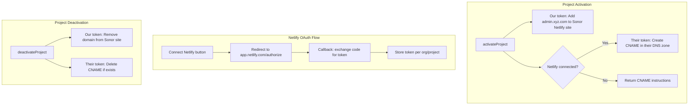
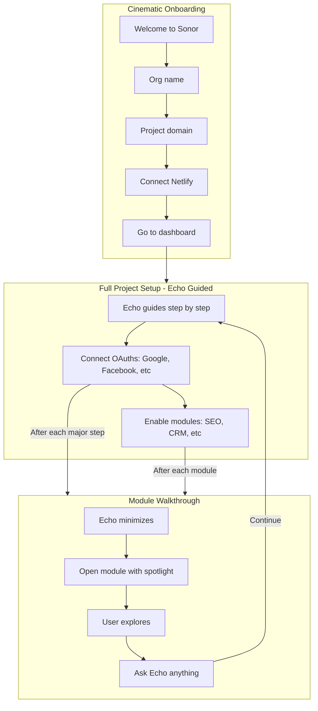

# Netlify Custom Domain Automation for admin.{domain}

## Goal

When a client activates a project with domain `xyz.com`, enable `admin.xyz.com` for the Sonor frontend. When they connect their Netlify account via OAuth, fully automate CNAME creation and inject `SONOR_API_KEY`. Otherwise, add the domain to our Netlify site and provide CNAME instructions.

## Current State

**No existing Netlify or Vercel integration.** The codebase has:
- OAuth for Google (GSC, GBP, Gmail, Calendar), Facebook, LinkedIn, TikTok, Yelp, Trustpilot
- `user_workspace_integrations` for per-user Google (Gmail, Calendar, Drive)
- Commerce OAuth (Shopify) — separate module

Netlify and Vercel integrations will be built from scratch.

## Architecture



## Implementation

### 1. Netlify OAuth App Setup

- Register OAuth app at [Netlify Applications](https://app.netlify.com/applications)
- Redirect URI: `https://app.sonor.io/integrations/netlify/callback` (and localhost for dev)
- Store `NETLIFY_OAUTH_CLIENT_ID` and `NETLIFY_OAUTH_CLIENT_SECRET` in env

### 2. Token Storage

**Schema:** Add to `organizations` or new `org_integrations` table:

- `netlify_access_token` (encrypted)
- `netlify_refresh_token` (if supported)
- `netlify_connected_at`

Or use existing `user_workspace_integrations` pattern if one exists for org-level integrations.

### 3. Netlify Module (Portal API)

**New module:** [portal-api-nestjs/src/modules/netlify/](portal-api-nestjs/src/modules/netlify/)

**NetlifyService:**
- `addDomainToSite(siteId: string, domain: string, accessToken: string)` — Add custom domain (uses our token for Sonor site)
- `removeDomainFromSite(siteId: string, domain: string, accessToken: string)`
- `createDnsRecord(siteId: string, zoneId: string, record: { hostname, type, value }, accessToken: string)` — Create CNAME in a zone
- `deleteDnsRecord(siteId: string, zoneId: string, recordId: string, accessToken: string)`
- `findSiteByDomain(accessToken: string, domain: string)` — List sites, find one with matching custom domain
- `getDnsZoneForSite(siteId: string, accessToken: string)` — Get DNS zone ID for a site
- `setEnvVar(siteId: string, key: string, value: string, accessToken: string)` — Add `SONOR_API_KEY` to client site (mark as secret)

**NetlifyController:**
- `GET /integrations/netlify/connect` — Redirect to Netlify OAuth
- `GET /integrations/netlify/callback` — Exchange code, store token, redirect back to app
- `DELETE /integrations/netlify/disconnect` — Revoke and clear stored token

**Env vars:**
- `NETLIFY_OAUTH_CLIENT_ID`
- `NETLIFY_OAUTH_CLIENT_SECRET`
- `NETLIFY_SITE_ID` — Sonor frontend site ID
- `NETLIFY_ACCESS_TOKEN` — Our PAT for Sonor site operations (add/remove domain)

### 4. Subscription Flow Hooks

**File:** [portal-api-nestjs/src/modules/billing/subscription.service.ts](portal-api-nestjs/src/modules/billing/subscription.service.ts)

**activateProject:**
- Derive `adminDomain = 'admin.' + normalizeDomain(project.domain)`
- Use **our** token to add `adminDomain` to Sonor Netlify site
- If org has `netlify_access_token`:
  - Find client's site with `project.domain`
  - Get DNS zone for that site
  - Create CNAME: `admin` -> `sonor-site.netlify.app`
  - Add `SONOR_API_KEY` env var to their site (project API key, mark secret)
  - Set `admin_domain_automated: true`
- Else: set `cnameSetup` in response with instructions
- Store `admin_domain` on project

**deactivateProject:**
- Use our token to remove `admin_domain` from Sonor site
- If `admin_domain_automated` and org has Netlify token: delete CNAME record
- Clear `admin_domain`, `admin_domain_automated` on project

### 5. Database Changes

**Migration:**
```sql
ALTER TABLE projects ADD COLUMN IF NOT EXISTS admin_domain text;
ALTER TABLE projects ADD COLUMN IF NOT EXISTS admin_domain_automated boolean DEFAULT false;
-- Token storage: use org_integrations or add netlify_* columns to organizations
```

### 6. Where to Run the OAuth Flow

**Entry points (user can connect from any of these):**

| Entry Point | When | UX |
|-------------|------|-----|
| **NewProjectModal** (post-activation) | After creating + activating a project | Show "Connect Netlify to automate setup" card with button. Modal stays open to show API key; add Connect Netlify below it. |
| **Project Settings / Integrations** | Anytime | "Connect Netlify" and "Connect Vercel" in integrations panel. |
| **Echo dialogue** | When user asks for setup help or Echo detects new project | Echo suggests connecting; returns a clickable link/button that opens OAuth URL. |
| **First-time / post-purchase** | Optional: welcome modal after first login or subscription | "Set up your first project" wizard that can include Connect Netlify step. |

**OAuth callback:** Always redirects to `returnPath` (e.g. `/messages?tab=echo` for Echo flow, or `/projects/{id}/settings` for project flow). Callback URL: `https://api.sonor.io/integrations/netlify/callback` (Portal API).

### 7. Echo Dialogue as Setup Flow

**Idea:** Make the whole setup (project creation, activation, Netlify connect) feel like a conversation with Echo.

**How it works:**
- Echo has context: new projects, activation status, whether Netlify is connected.
- When user says "set up my project" or "I just activated xyz.com", Echo can:
  1. Confirm project details
  2. Say: "I can automate admin.xyz.com and add your API key to your site. Connect your Netlify account?"
  3. Echo invokes a tool (e.g. `get_netlify_connect_url`) that calls Portal API, returns `{ url, label: "Connect Netlify" }`
  4. Echo UI renders the tool result as a button/link. User clicks → OAuth popup or redirect.
  5. Callback redirects to `/messages?tab=echo&netlify=connected`. Echo shows: "Netlify connected! I've configured admin.xyz.com and added your API key."

**Requirements:**
- **Signal API:** Add a tool (e.g. in setup skill) that calls Portal API internally or returns a URL. The tool could be `get_integration_connect_url` with params `{ provider: 'netlify', orgId, returnPath }` — it would need to call Portal API (server-to-server) to get the OAuth URL, or the Portal API could expose a short-lived token that the frontend uses.
- **Simpler approach:** Tool returns `{ action: 'open_url', url: 'https://api.sonor.io/integrations/netlify/connect?orgId=...&returnPath=...' }`. Echo frontend detects this and renders a button. No server-to-server needed — the connect URL is deterministic (orgId + returnPath from context).
- **Echo UI:** Must render tool results that are `open_url` actions as clickable buttons. Check if Echo already supports this or needs a new renderer.

---

## Cinematic First-Time Onboarding (Primary Vision)

**Concept:** Full-screen "Welcome to Sonor" experience on first login. Echo is the guide — big typography, conversational flow, input fields for everything. Feels like a cinematic setup, not a form wizard.

### The Experience

- **Trigger:** First-time login (no projects, or new org with no projects)
- **Layout:** Full-screen takeover. Dark or minimal background. Echo's messages in large, readable type. Single input area or contextual fields below.
- **Flow:** Echo "speaks" one step at a time. User responds via input or buttons. Progress is tracked (e.g. 1/5, 2/5) but subtle — the focus is the conversation.

### Example Flow

```
[Full screen, centered]

Echo: "Welcome to Sonor. Let's get you set up."

[Input: "What's your organization or company name?"]
→ User: "Acme Corp"

Echo: "Nice to meet you, Acme Corp. What's your website domain?"

[Input: "e.g. acme.com"]
→ User: "acme.com"

Echo: "I'll set up admin.acme.com for your dashboard. Connect your Netlify account so I can configure everything automatically?"

[Button: Connect Netlify]  [Skip for now]

→ User connects → OAuth popup → returns

Echo: "Connected! I've added your API key and configured admin.acme.com. You're all set."

[Button: Go to dashboard]
```

### Progress Tracking

- **Schema:** `org_onboarding` or `user_onboarding` table: `org_id`, `user_id`, `step`, `completed_at`, `metadata` (e.g. `{ orgName, domain, netlifyConnected }`)
- **Steps:** e.g. `welcome` → `org_name` → `project_domain` → `connect_netlify` → `complete`
- **Resumable:** If they close and come back, Echo picks up: "You were setting up acme.com. Ready to connect Netlify?"
- **Skip/dismiss:** "Skip for now" stores progress; they can finish later from Settings or Echo

### Technical Approach

- **Route:** `/onboarding` or `/welcome` — full-screen layout, no sidebar
- **State:** Local state + persisted to `org_onboarding`. Each step advances the flow.
- **Echo copy:** Can be static (we know the steps) or Echo API for dynamic phrasing. Static is simpler for v1.
- **Inputs:** Contextual — text input, or Connect Netlify button, or "Go to dashboard". Render based on current step.
- **Cinematic touches:** Subtle fade-in for each message, generous whitespace, large font (e.g. 1.5rem–2rem for Echo text), maybe a soft gradient or blur background.

### When to Show

- **Redirect:** On app load, if `!hasProjects` and `!onboarding_dismissed` → redirect to `/onboarding`
- **Entry:** First-time login, or new org with no projects
- **Optional:** After Stripe subscription webhook for new signup
- **Dismissible:** "I'll do this later" → set `onboarding_dismissed_at`; show again only if they open "Get started" from dashboard or Settings

---

## Full Project Setup Audit — Everything Echo Must Guide Through

### Modules (Portal Dashboard)

| Module | What It Needs | OAuth / Integration |
|--------|---------------|----------------------|
| **SEO** | GSC data, GBP | Google (GSC property, GBP location) |
| **Analytics** | Page views, events | Site-kit on site; no OAuth |
| **CRM** | Contacts, deals | Gmail OAuth (optional, for email hub) |
| **Reputation** | Reviews, replies | Google (GBP), Facebook, Yelp, Trustpilot |
| **Broadcast** | Social posting | Facebook, LinkedIn, TikTok |
| **Sync** | Bookings, calendar | Google Calendar (user workspace) |
| **Commerce** | Products, checkout | Shopify, Square, Stripe |
| **Engage** | Popups, widgets | Site-kit; no OAuth |
| **Forms** | Form submissions | Site-kit; no OAuth |
| **Blog** | Content | Site-kit; no OAuth |
| **Proposals** | Proposals, deposits | Stripe |
| **Files** | Docs, Drive | Google Drive (user workspace) |
| **Messages** | Chat, Echo | No setup |
| **Billing** | Subscription | Stripe (org-level) |

### OAuth / Integrations Summary

- **Google (project):** GSC, GBP, Gmail — one OAuth, multiple modules
- **Google (user workspace):** Gmail, Calendar, Drive — per-user
- **Facebook, LinkedIn, TikTok:** Broadcast, Reputation
- **Yelp, Trustpilot:** Reputation
- **Shopify, Square:** Commerce
- **Netlify, Vercel:** Hosting, API key injection, admin subdomain

### Project Prerequisites

- Org + project created
- Domain set
- Project activated (API key)
- Site-kit installed on marketing site (`SONOR_API_KEY`)
- Optional: admin.xyz.com custom domain

---

## Full Onboarding Flow (Echo + Module Walkthroughs)



---

## Module Walkthroughs — Echo Minimizes, Shows the UI

**Concept:** After each major setup step, Echo "steps aside" and the UI takes over. User sees the actual module with a guided overlay or spotlight.

**Flow example:**
1. Echo: "Let's connect Google Search Console so I can track your rankings."
2. [Connect Google] → OAuth → callback
3. Echo: "Connected! Now let me show you the SEO module." → **Echo minimizes to corner or sidebar**
4. **SEO module opens** with a spotlight overlay: "This is where you see rankings. Click here to add keywords." User can explore.
5. "Ask me anything" or "Continue" → Echo expands, next step: "Ready to connect Google Business Profile for reviews?"

**Technical:**
- `onboarding_step` includes `module_walkthrough: 'seo'` — route to `/seo` with `?tour=1` or overlay
- Walkthrough overlay component: highlights UI elements, "Next" / "Got it"
- Echo can be a floating pill or sidebar during walkthrough
- User can type "What does this do?" at any time → Echo expands, answers

---

## Sonor Support Skill / Knowledge Base

**Goal:** Echo has deep, accurate knowledge of Sonor — modules, OAuth flows, setup, troubleshooting.

**Options:**

1. **Support skill:** New Signal skill `support` or `sonor` with:
   - System prompt: Sonor product knowledge
   - Tools: `get_module_docs`, `get_setup_steps`, `get_oauth_requirements`
   - Context: Injected from a curated knowledge base

2. **Knowledge base:** Dedicated content for Echo:
   - `signal_knowledge` or new `sonor_product_knowledge` table
   - Chunks: "SEO module: connects GSC, GBP. OAuth flow: ..."
   - RAG: Echo retrieves relevant chunks when user asks "How does SEO work?"

3. **Hybrid:** Support skill + knowledge base. Skill orchestrates; knowledge provides the facts.

**Content to bake in:**
- Every module: what it does, what it needs, how to set it up
- Every OAuth: which platforms, which modules, scopes
- Common questions: "How do I add my site?", "Where is my API key?", "Why isn't GSC showing data?"
- Troubleshooting: "GSC not connected" → check OAuth, verify property, etc.

**Implementation:**
- Add `support` or `sonor` skill to Signal API
- Create seed content (markdown or structured) for each module
- Ingest into knowledge or use as system prompt
- Ensure Echo routes "how does X work?", "help with Y" to this skill

**Echo routing:** Echo's skill selection (or tool-calling) should prefer the support skill when the user asks product questions: "How does SEO work?", "What do I need for Reputation?", "Why isn't my GSC connected?", "Where do I find my API key?". The support skill can coexist with other skills — e.g. user asks "optimize my SEO" → SEO skill; "explain how SEO works" → support skill.

### 8. Frontend (Summary)

**Connect Netlify:**
- NewProjectModal post-activation: "Connect Netlify" card when `cnameSetup` in response
- Project Settings / Integrations: Connect Netlify, Connect Vercel
- Echo: Tool returns connect URL; UI renders as button

**Activation success:**
- If `cnameSetup`: show CNAME instructions
- If `admin_domain_automated`: "admin.xyz.com configured automatically"

**Project settings:**
- Display `admin.xyz.com` when set
- "Reconnect Netlify" if token expired

### 9. Netlify API Reference

- OAuth authorize: `https://app.netlify.com/authorize?client_id=...&redirect_uri=...&response_type=code&scope=...`
- Token exchange: `POST https://api.netlify.com/oauth/token`
- Sites: `GET https://api.netlify.com/api/v1/sites`
- Domain aliases: `PATCH /sites/{id}` with `domain_aliases` or domain-specific endpoints
- DNS: `POST /sites/{id}/dns` or `createDnsRecord` (verify exact path in OpenAPI)

### 10. Env Var Injection (Netlify / Vercel)

When Netlify (or Vercel) is connected, inject `SONOR_API_KEY` into the client's site so site-kit works without manual setup.

**Flow:**
- On activation: if Netlify connected, find site by `project.domain`, add `SONOR_API_KEY` = project API key
- On connect: if org has active projects, add `SONOR_API_KEY` for each matching site
- On deactivation: optionally remove env var (or leave; key revocation handles security)

**Vercel:** Same idea — `setEnvVar` on their project. Requires separate Vercel OAuth flow.

**Env var name:** `SONOR_API_KEY` only (server-side; site-kit uses this, no `NEXT_PUBLIC_` variant)

### 11. Edge Cases

- **Token expired:** Detect 401, prompt "Reconnect Netlify"
- **Domain not on Netlify DNS:** Can't create CNAME; fall back to instructions
- **Multiple sites with same domain:** Use first match or let user pick
- **Netlify add fails:** Log, don't block activation; store domain for retry

### 12. Plan Validation (Triple-Check)

**Potential issues:**
- **Netlify DNS zone:** CNAME creation only works when the client's domain uses Netlify DNS (nameservers point to Netlify). If they use external DNS (Cloudflare, GoDaddy), we cannot create the record — fall back to instructions. The `findSiteByDomain` finds their site; `getDnsZoneForSite` may return null if they don't use Netlify DNS. Handle gracefully.
- **Org vs user token:** Netlify OAuth is per-user. When they connect, we store the token. Who "owns" it? The org. Store `netlify_access_token` on the org (or `org_integrations` table) and associate with the user who connected. If that user leaves, token stays — org admin can reconnect.
- **Callback URL:** Must be `https://api.sonor.io/integrations/netlify/callback` (Portal API). Register this in Netlify OAuth app. For local dev: `http://localhost:3002/integrations/netlify/callback`.
- **State param:** Include `orgId`, `returnPath`, `userId` in state for CSRF validation. Same pattern as existing OAuth.
- **Echo tool:** The `get_netlify_connect_url` tool needs `orgId` from context. Echo receives `orgId`/`projectId` in the request. Ensure setup skill has access.

## Files to Create/Modify

| File | Action |
|------|--------|
| `portal-api-nestjs/src/modules/netlify/netlify.service.ts` | Create |
| `portal-api-nestjs/src/modules/netlify/netlify.controller.ts` | Create |
| `portal-api-nestjs/src/modules/netlify/netlify.module.ts` | Create |
| `portal-api-nestjs/src/modules/billing/subscription.service.ts` | Modify |
| `portal-api-nestjs/src/modules/billing/dto/subscription.dto.ts` | Modify |
| Migration: `add_admin_domain_and_netlify_integration` | Create |
| `uptrade-portal-vite` — NewProjectModal: Connect Netlify card post-activation | Modify |
| `uptrade-portal-vite` — Project Settings: Integrations panel (Netlify, Vercel) | Modify |
| `uptrade-portal-vite` — Echo: Render `open_url` tool results as buttons | Modify (if needed) |
| `signal-api-nestjs` — Setup skill: `get_netlify_connect_url` tool | Create/Modify |
| `uptrade-portal-vite` — `/onboarding` full-screen route | Create |
| `uptrade-portal-vite` — OnboardingConversation component (Echo-style UI, steps, inputs) | Create |
| Migration: `add_org_onboarding` (step, metadata, completed_at) | Create |
| Portal API: `GET/PUT /onboarding` (progress) | Create |
| `uptrade-portal-vite` — Module walkthrough overlay (spotlight, "Next" / "Got it") | Create |
| `uptrade-portal-vite` — Echo minimized state (floating pill / sidebar during walkthrough) | Modify |
| `signal-api-nestjs` — Support/Sonor skill (product knowledge, tools) | Create |
| `signal-api-nestjs` — Sonor knowledge base (seed content, RAG or system prompt) | Create |
| `org_onboarding` — Extended steps for full project setup (OAuths, modules, walkthroughs) | Modify |

**Vercel:** Same pattern as Netlify — separate OAuth app, `org_integrations` or `vercel_*` columns, `setEnvVar` for `SONOR_API_KEY`. Add when Netlify flow is proven.
